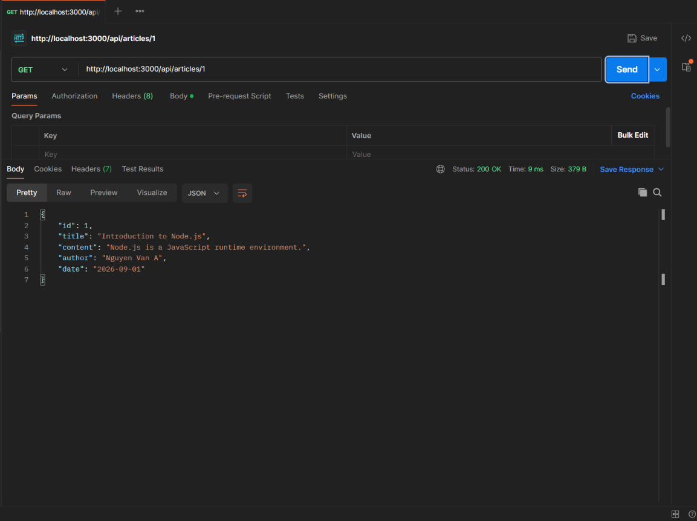
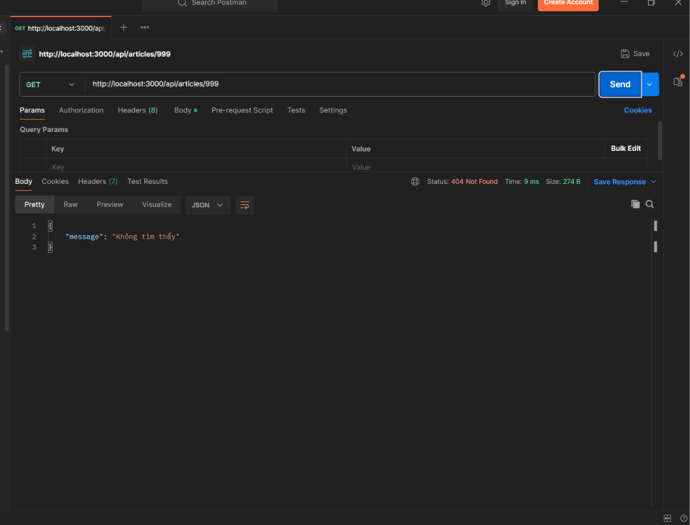
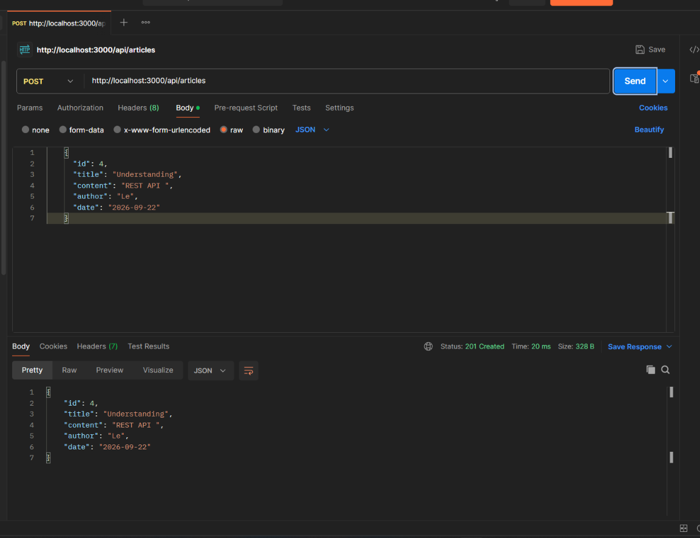
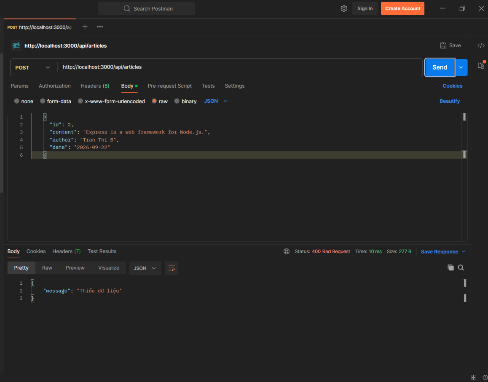
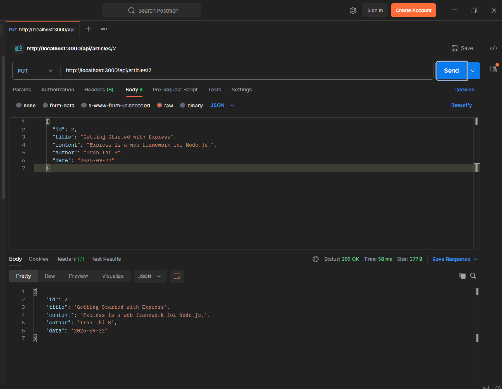
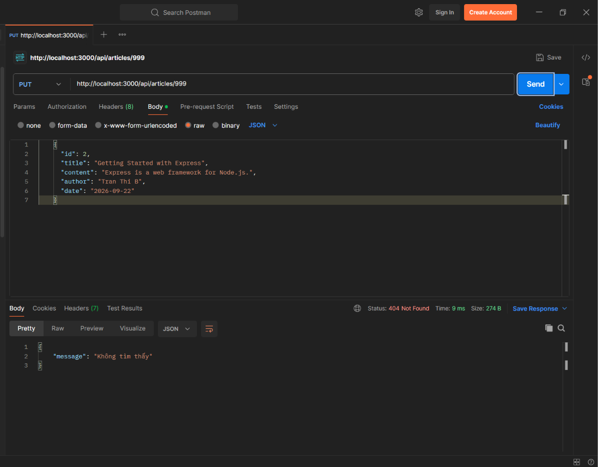
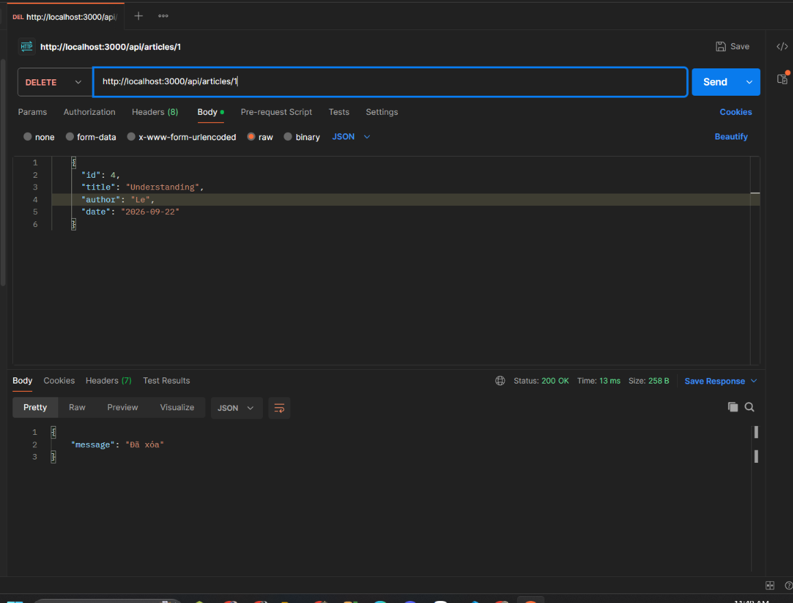
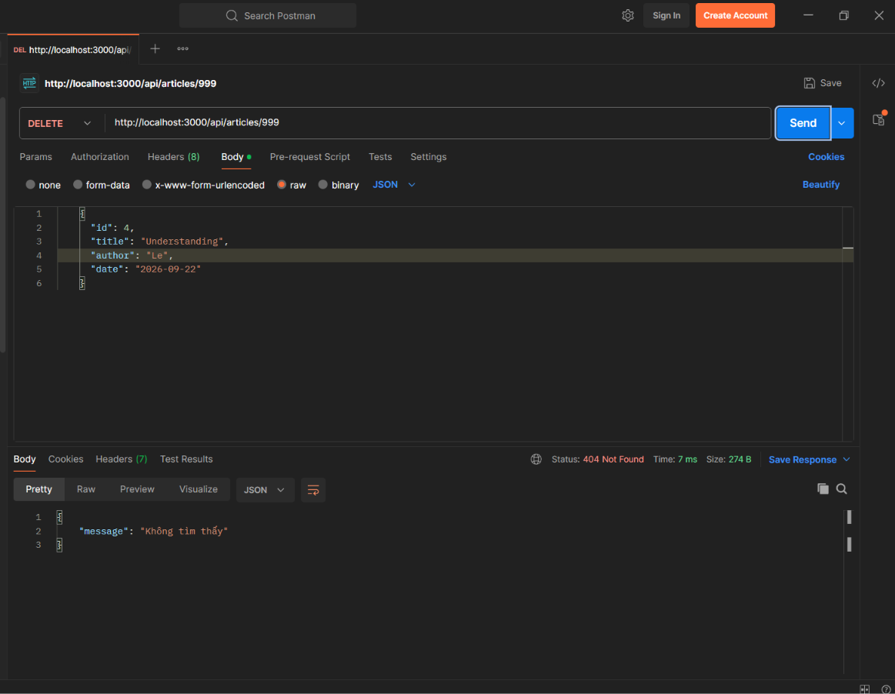

1. Đinh Thị Thu Trang
2. HE195077

GET /articles

GET /articles/1

GET /articles/999

POST /articles/

POST /articles/ (thiếu dữ liệu)

PUT /articles/1

PUT /articles/999

DELETE /articles/1

DELETE /articles/999

GET /comments

GET /comments/1

GET /comments/999

POST /comments (articleID hợp lệ)

POST /comments (articleID không tồn tại)

PUT /comments/1

PUT /comments/999

DELETE /comments/1

DELETE /comments/999
.
